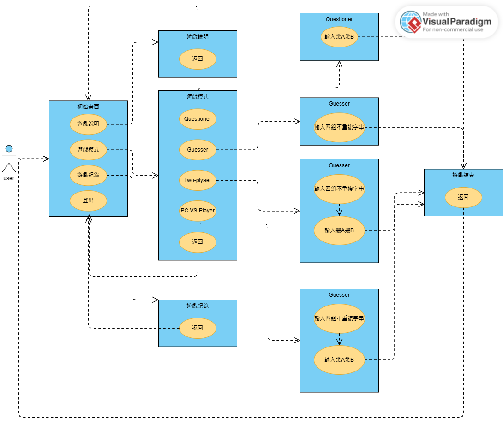
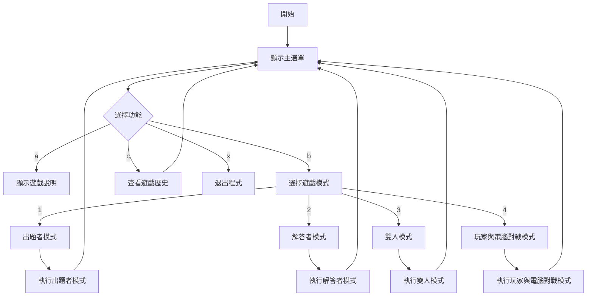

# README

## 作者
**姓名：** 孫健淳  
**學號：** [412410109]

---

## 程式概述
本程式實現了一款 1A2B 猜數字遊戲，主要功能包括：

- **遊戲模式：**
  1. 出題者模式：玩家設定數字，電腦負責猜測。
  2. 解答者模式：電腦設定數字，玩家負責猜測。
  3. 雙人模式：兩位玩家輪流擔任出題者與解答者。
  4. 玩家與電腦對戰模式：玩家與電腦競速猜數字。
- **遊戲歷史紀錄：** 記錄每場遊戲的模式、結果及時間戳。
- **易於操作的介面：** 基於選單的系統便於導航。

---

## 程式特色
1. **多樣化遊戲模式：** 提供四種不同的遊戲模式，增加趣味性。
2. **遊戲歷史紀錄：** 儲存並顯示遊戲結果，便於回顧。
3. **作弊檢測：** 確保輸入數據的一致性，維持公平性。
4. **良好程式結構：** 模組化函數設計與可讀的變數命名，方便維護。
5. **額外功能：**
   - 帶時間戳的遊戲紀錄。
   - 玩家與電腦對戰的競技模式。
   - 以 ASCII 藝術增強視覺效果的介面與遊戲說明介紹。
   - 玩家與玩家的對戰。

---

## 流程圖

### User Case


---

### FlowChart
以function 為主要的flow chart


每個function各自的flow chart


---

## 使用說明

### 編譯方式
若有多個檔案，請使用以下指令進行編譯：
```bash
gcc player.c questioner.c mainGame.c gameUI.c twoplayerModel.c gameHistory.c -o game
```

### 執行方式
執行以下指令啟動程式：
```bash
./game
```

### 功能選單
1. **遊戲說明 (a):** 顯示遊戲規則與操作說明。
2. **遊戲模式 (b):**
   - **1:** 出題者模式。
   - **2:** 解答者模式。
   - **3:** 雙人模式。
   - **4:** 玩家與電腦對戰模式。
3. **遊戲歷史 (c):** 檢視過往遊戲紀錄。
4. **退出程式 (x):** 結束程式。

### 遊戲操作
- 根據螢幕指示輸入您的答案或選擇。
- 使用數字鍵 (1-4) 或特定字元 (a, b, c, x) 導航。

---

## 執行畫面截圖

### 主選單


### 遊戲模式


### 遊戲過程


### 遊戲歷史


---

## 新功能
1. **遊戲歷史紀錄：** 所有遊戲均以時間戳記錄並儲存。
2. **玩家與電腦對戰模式：** 玩家與電腦競速猜數字的全新模式。
3. **作弊檢測：** 驗證使用者輸入的正確性，防止作弊行為。
4. **強化介面設計：** 使用 ASCII 藝術美化操作介面。

---

## 程式品質
- **註解：** 詳盡的註解說明每個函數的邏輯。
- **可讀性：** 恰當的縮排與有意義的變數命名。
- **模組化設計：** 程式碼分為多個檔案，提高可維護性。

---

## 注意事項
- 確保 `game_history.txt` 檔案與程式位於同一目錄下，用於儲存遊戲歷史。
- 如有任何問題或建議，可聯繫信箱：apple0908070605@gmail.com。

